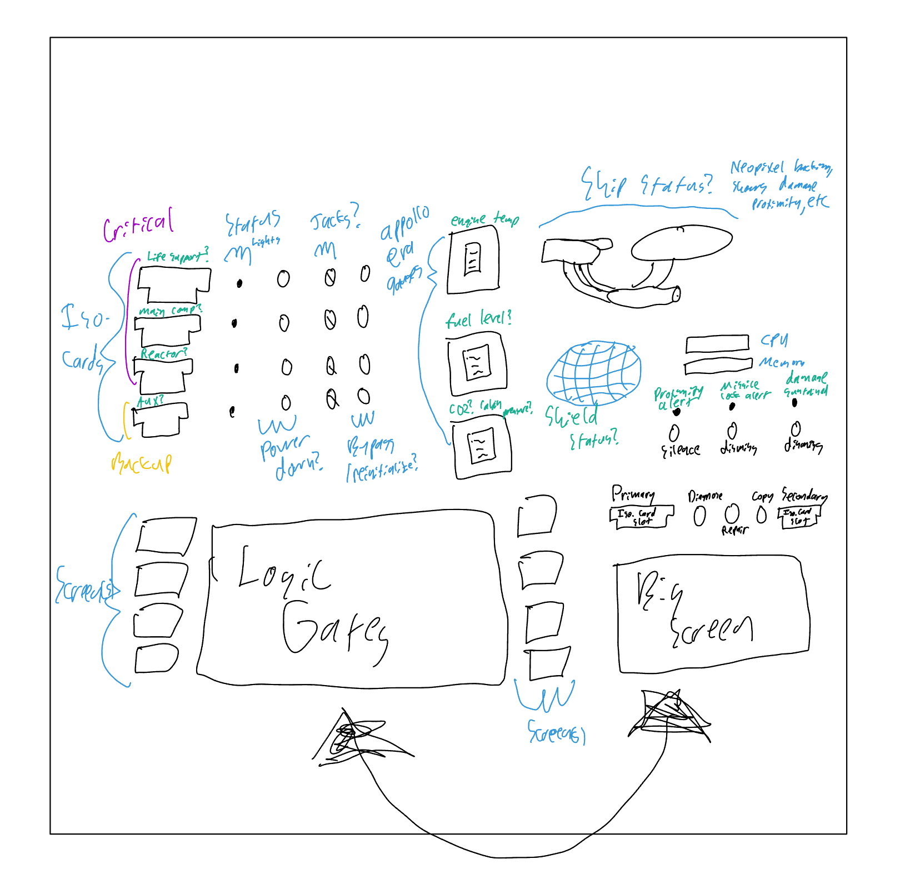

# Logic Initialization Panel

Created by the BYU IEEE Branch for the CMSC

The idea is that you take an isolinear chip that is "broken" and you place it in to have a certain logic circuit "fixed/repaired" the screen gives you a guide to be able to solve the puzzle/prompt. you then "write" it to the card

This panel teaches basic boolean logic (not, and, or) to children, or can be configured to challenge adults with more gates/configurations

